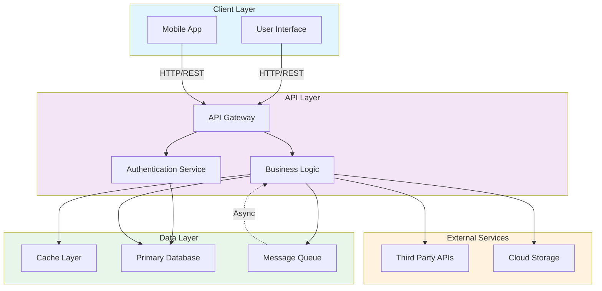

# Architecture Overview

This document provides a visual overview of the system architecture.

## System Architecture

## Components

- **Client Layer**: User-facing applications (web UI and mobile)
- **API Layer**: Handles authentication, routing, and business logic
- **Data Layer**: Manages caching, persistence, and asynchronous processing
- **External Services**: Third-party integrations and storage solutions

## Data Flow

1. Clients send requests to the API Gateway
2. Gateway routes through Authentication Service
3. Business Logic processes requests
4. Data is retrieved from Cache or Database
5. Long-running operations are queued for async processing
6. Responses are sent back to clients